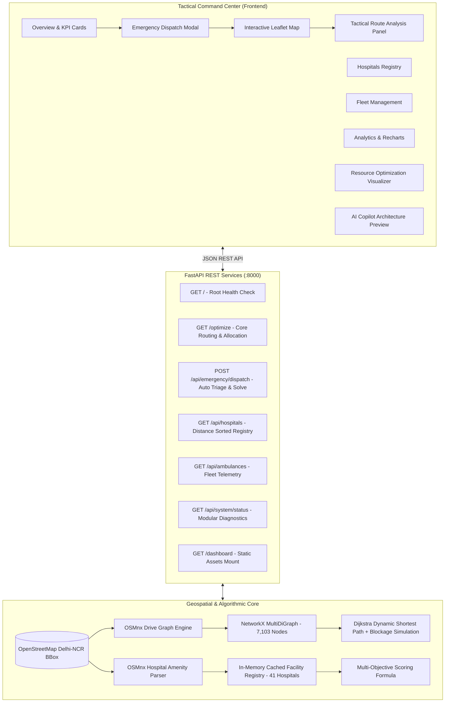

# AI-Driven Dynamic Emergency Response & Multi-Objective Resource Optimization System

> **B.Tech Major Project — Mid-Term Evaluation & Technical Viva Prototype**  
> **Repository:** [emergency-response-system](https://github.com/Ananyasaxena26/emergency-response-system)  
> **Demonstration Platform:** Emergency Operations Command Center (EOCC)

---

## 1. Project Overview

The **AI-Driven Dynamic Emergency Response and Multi-Objective Resource Optimization System** is an intelligent emergency dispatch, routing, and hospital allocation platform designed for metropolitan transit corridors (demonstrated across Central Delhi-NCR).

Traditional emergency response systems suffer from disconnected dispatch workflows, static routing that fails during sudden road blockages, and nearest-hospital assignments that inadvertently overwhelm emergency rooms. This project introduces:
1. **Dynamic Graph-Based Routing:** Real-time road network pathfinding powered by **OSMnx** and **NetworkX**, featuring automated obstacle and road blockage simulation with dynamic Dijkstra recalculation.
2. **Multi-Objective Hospital Allocation:** Balances transit distance, travel time, and hospital bed congestion ratios to select optimal care facilities rather than simply the closest one.
3. **Tactical Operations Dashboard:** A dark-themed command-center dashboard built with **React**, **Vite**, **Leaflet**, and **Lucide Icons** that gives dispatchers situational awareness over active incidents, ambulance fleets, and 41 healthcare facilities.

---

## 2. System Architecture



---

## 3. Technology Stack

| Layer | Technologies | Role / Purpose |
|---|---|---|
| **Geospatial & Graph Engine** | Python 3.13, OSMnx 2.1.1, NetworkX 3.6.1, GeoPandas, Shapely | Road network graph extraction (7,103 nodes), shortest-path routing, road blockage simulation. |
| **Backend REST API** | FastAPI 0.141.1, Uvicorn 0.53.0, Pydantic | High-performance asynchronous API endpoints with CORS and Swagger UI documentation. |
| **Frontend Framework** | React 18, Vite 5.4, JavaScript (ESM) | Responsive Single Page Application (SPA) command center. |
| **Geospatial Visualization** | Leaflet 1.9.4, OpenStreetMap Tiles | High-contrast tactical map, live incident pulse, polyline path rendering, hospital & fleet markers. |
| **Telemetry & UI Components**| Lucide React, Recharts 2.15, Custom CSS | Interactive KPI cards, weight tuning sliders, and metric charts. |

---

## 4. Current Implementation vs. Planned Final Phase

To ensure **complete academic honesty** during university evaluation, the system architecture explicitly delineates current operational modules from planned final-phase extensions:

| System Component | Status | Current Implementation (Mid-Term) | Planned Final Phase (Final Year) |
|---|---|---|---|
| **Road Network Graph** | Operational | Real OpenStreetMap drive network of Central Delhi (7,103 intersections, 15,000+ street segments). | Dynamic integration with live city traffic telematics and camera sensor feeds. |
| **Routing Algorithm** | Operational | NetworkX Dijkstra shortest path with automated road blockage detection and dynamic alternate path calculation. | Time-dependent $A^*$ search with historical traffic rush-hour speed curves. |
| **Hospital Registry** | Operational | 41 real OpenStreetMap hospital centroids with in-memory caching (<5ms response). | Real-time EHR/HL7 FHIR API synchronization with municipal hospital bed registries. |
| **Optimization Formula** | Operational | Multi-objective cost formulation: $\text{Score} = (d \times 0.7) + (\text{CongestionRatio} \times 3.0)$. | Multi-Objective Evolutionary Algorithm (NSGA-II) for dynamic fleet reallocation and Pareto frontier selection. |
| **Fleet Tracking** | Prototype Demo | In-memory fleet registry of 12 mobile units stationed across Central Delhi posts. | Real-time MQTT/GPS hardware tracker integration on physical response vehicles. |
| **AI Copilot** | Planned Final Phase | Architectural design preview and prompt interface specification. | Local LLM / RAG agent querying NetworkX telemetry to provide natural language operational briefs. |

---

## 5. Installation & Setup

### Prerequisites
- **Python:** 3.10 to 3.13 (Python 3.13.5 recommended)
- **Node.js:** v18 or newer (Node v25.9.0 tested)
- **Git**

### Step 1: Clone Repository
```bash
git clone https://github.com/Ananyasaxena26/emergency-response-system.git
cd emergency-response-system
```

### Step 2: Set Up Python Virtual Environment
```bash
# Activate existing virtual environment or create a new one
source venv/bin/activate

# Verify dependencies
pip install fastapi uvicorn osmnx networkx geopandas shapely pandas numpy
```

### Step 3: Set Up Frontend (React + Vite)
```bash
cd frontend
npm install
npm run build
cd ..
```

---

## 6. How to Run the Application

The project supports two convenient execution workflows:

### Method A: Unified Execution (FastAPI Serves Both Backend & Frontend)
1. In the project root directory with `venv` activated, start Uvicorn:
   ```bash
   source venv/bin/activate
   uvicorn main:app --reload --port 8000
   ```
2. Open your web browser:
   - **Command Center Dashboard:** [http://127.0.0.1:8000/dashboard](http://127.0.0.1:8000/dashboard)
   - **Interactive API Documentation (Swagger UI):** [http://127.0.0.1:8000/docs](http://127.0.0.1:8000/docs)
   - **Legacy Prototype Page:** Open `index.html` or `index_legacy.html`

### Method B: Developer Mode (Hot Reloading Frontend)
1. **Terminal 1 (Backend):**
   ```bash
   source venv/bin/activate
   uvicorn main:app --reload --port 8000
   ```
2. **Terminal 2 (Frontend Dev Server):**
   ```bash
   cd frontend
   npm run dev
   ```
3. Open [http://localhost:5173](http://localhost:5173) in your browser.

---

## 7. API Reference Documentation

All endpoints are hosted at `http://127.0.0.1:8000` with interactive Swagger docs at `/docs`.

### 1. Root System Health
- **Endpoint:** `GET /`
- **Description:** Verifies FastAPI backend availability.
- **Response:**
  ```json
  {
    "system": "AI-Based Dynamic Emergency Response System",
    "status": "Operational"
  }
  ```

### 2. Core Routing & Optimization
- **Endpoint:** `GET /optimize`
- **Query Parameters:**
  - `ambulance_lat` (float, default: `28.6139`)
  - `ambulance_lon` (float, default: `77.2090`)
  - `incident_lat` (float, default: `28.6280`)
  - `incident_lon` (float, default: `77.2200`)
- **Response:**
  ```json
  {
    "status": "Success",
    "input_coordinates": {
      "ambulance": {"lat": 28.6139, "lon": 77.2090},
      "incident": {"lat": 28.6280, "lon": 77.2200}
    },
    "routing_details": {
      "source_node": 249782331,
      "incident_node": 249782337,
      "simulation_event": "Blocked road segment between node 249782331 and 1869716862",
      "rescue_path_length": 16,
      "graph_nodes_count": 7103,
      "path_coordinates": [[28.6316, 77.2217], [28.6337, 77.2218]],
      "distance_km": 1.39,
      "estimated_time_min": 2.4
    },
    "assigned_hospital": {
      "hospital_id": "('node', 8151246349)",
      "name": "General Williams Hospital",
      "available_beds": 50,
      "distance_km": 0.22,
      "specialization": "Multi-Specialty Emergency"
    },
    "recommended_action": "Ambulance dispatched! Assigned to General Williams Hospital (0.22 km away) with 50 beds available."
  }
  ```

### 3. Hospital Registry
- **Endpoint:** `GET /api/hospitals?lat={lat}&lon={lon}`
- **Description:** Returns the 41 real OpenStreetMap hospitals in Central Delhi, sorted by proximity to incident coordinates if provided.

### 4. Ambulance Fleet Telemetry
- **Endpoint:** `GET /api/ambulances`
- **Description:** Returns fleet telemetry, unit coordinates, ALS/BLS qualification, fuel levels, and current mission status.

### 5. Emergency Incident Dispatch
- **Endpoint:** `POST /api/emergency/dispatch`
- **Body:**
  ```json
  {
    "emergency_type": "Accident",
    "severity": "Critical",
    "patient_count": 2,
    "location_name": "Connaught Place Circle",
    "incident_lat": 28.6315,
    "incident_lon": 77.2167,
    "notes": "Severe vehicle collision"
  }
  ```
- **Description:** Automatically pairs the closest available ambulance, solves dynamic NetworkX Dijkstra shortest path, reroutes around road blockages, and solves multi-objective hospital allocation.

### 6. System Architecture Status
- **Endpoint:** `GET /api/system/status`
- **Description:** Telemetry diagnostics reporting OSMnx node count, active cache status, server uptime, and subcomponent health.

---

## 8. 5-Minute Viva Demonstration Guide

Follow this sequence during your mid-term project evaluation:

| Minute | Step | Viva Action | What to Explain to Examiners |
|---|---|---|---|
| **0:00 - 1:00** | **1. Overview & System Health** | Open [http://127.0.0.1:8000/dashboard](http://127.0.0.1:8000/dashboard). Highlight top KPI cards and live system status badge. | Explain the motivation: traditional dispatch relies on static routes and closest hospital rules, causing delays and hospital bottlenecks. Point out that all baseline demo data is cleanly labeled. |
| **1:00 - 2:00** | **2. Create Emergency Incident** | Click **"New Emergency Request"** (or **"Trigger Viva Demo Incident"**). Select *Accident*, *Critical*, preset *Connaught Place Circle*, casualties *3*, click **"Analyze & Dispatch Emergency"**. | Show input validation. Explain that the backend immediately locates the nearest unit (AMB-03), computes street distances across the 7,103-node OSMnx graph, and triggers multi-objective optimization. |
| **2:00 - 3:00** | **3. Tactical Map & Dynamic Reroute** | Switch to **Map & Routing** tab. Point out the glowing cyan rescue route, the pulsing incident pin, and the dashed red segment. | **Crucial Viva Highlight:** Explain how the backend simulated a sudden road blockage on the primary street segment, removed the edge in NetworkX, and dynamically recalculated an alternative route in real time. |
| **3:00 - 3:45** | **4. Multi-Objective Hospital Allocation** | Inspect the **Route Analysis Card** and navigate to the **Resource Optimization** tab. Adjust the *Distance Weight* and *Bed Congestion Weight* sliders. | Show examiners that the algorithm didn't just pick the closest clinic; it balanced proximity ($w_1 = 0.7$) with bed availability ($w_2 = 3.0$) to select a facility capable of handling trauma casualties. Sliders prove live mathematical re-ranking. |
| **4:45 - 5:00** | **5. System Status & Academic Scope** | Open **System Status** tab and click **FastAPI Swagger Docs**. | Show that the architecture is fully decoupled (FastAPI, OSMnx, React). Clearly restate the separation between Phase 1 (graph routing, OSM amenities, multi-objective scoring) and Phase 2 (evolutionary Pareto optimization, live traffic, RAG LLM Copilot). |

---

## 9. Academic Authors & Credits
- **Project Title:** AI-Driven Dynamic Emergency Response and Multi-Objective Resource Optimization System
- **Evaluation:** B.Tech Major Project Mid-Term Viva / Evaluation
- **Original Repository:** [Ananyasaxena26/emergency-response-system](https://github.com/Ananyasaxena26/emergency-response-system)
- **Geospatial Data:** &copy; [OpenStreetMap](https://www.openstreetmap.org) contributors via OSMnx
